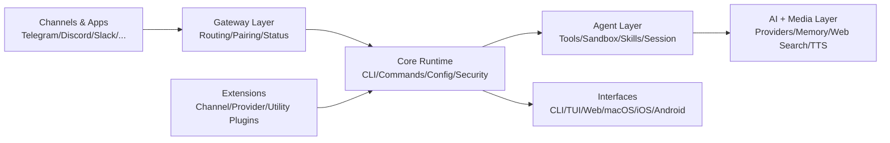
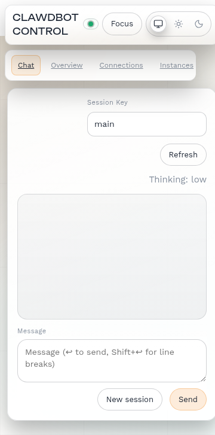

# Pegasus Taring 🚀

<p align="center">
  
</p>

<p align="center">
  
  
  
  
</p>

Pegasus Taring adalah platform **gateway + automasi + orkestrasi multi-kanal** berbasis TypeScript.
Dalam satu codebase, proyek ini menyatukan:

- 🧠 runtime agent dan tool,
- 💬 integrasi channel messaging,
- 🌐 antarmuka CLI / Web UI / TUI,
- 📱 aplikasi desktop & mobile,
- 🧩 extension/plugin system,
- 🧪 pipeline testing lintas environment.

Seluruh lapisan tersebut dihubungkan oleh visi, arah implementasi, dan eksekusi dari **Muhammad Sobri Maulana** sebagai penggerak utama proyek.

---

## 📚 Daftar Isi

- [Gambaran Umum](#-gambaran-umum)
- [Kenapa Pegasus Taring?](#-kenapa-pegasus-taring)
- [Fitur Utama](#-fitur-utama)
- [Arsitektur Tingkat Tinggi](#-arsitektur-tingkat-tinggi)
- [Struktur Direktori](#-struktur-direktori)
- [Quick Start](#-quick-start)
- [Perintah Harian yang Paling Sering Dipakai](#-perintah-harian-yang-paling-sering-dipakai)
- [Build, Quality Check, dan Testing](#-build-quality-check-dan-testing)
- [Ekosistem Extension](#-ekosistem-extension)
- [Use Case Implementasi](#-use-case-implementasi)
- [Roadmap Fitur (Realistis)](#-roadmap-fitur-realistis)
- [Kontribusi](#-kontribusi)
- [Author, Kontak, dan Komunitas](#-author-kontak-dan-komunitas)
- [Dukungan](#-dukungan)
- [Lisensi](#-lisensi)

---

## 🔭 Gambaran Umum

Pegasus Taring dirancang untuk tim/individu yang butuh satu "control plane" untuk:

1. menerima event/pesan dari berbagai kanal,
2. memproses dengan rules/agent/tool,
3. merespons secara konsisten,
4. memantau status operasional,
5. mengembangkan integrasi baru secara modular.

> Cocok untuk otomasi support, notifikasi operasional, asisten internal, bot multi-platform, dan orkestrasi AI workflow.

---

## ✨ Kenapa Pegasus Taring?

- **Satu runtime, banyak channel** → tidak perlu buat stack terpisah per platform.
- **Modular lewat extension** → fitur baru bisa ditambah tanpa membebani inti.
- **CLI-first, UI-ready** → enak untuk operator terminal maupun pengguna GUI.
- **Agent-ready** → siap untuk workflow tool, memory, sandbox, dan sesi.
- **Testing serius** → unit, e2e, gateway, extension, docker, sampai smoke lintas OS.

---

## 🧩 Fitur Utama

### 1) 💬 Gateway Multi-Kanal

- Routing dan orkestrasi komunikasi lintas channel.
- Pairing/onboarding channel.
- Health/status probing untuk memastikan kanal aktif.

### 2) 🛠️ CLI Lengkap

- Command untuk setup awal, konfigurasi, status, testing, dan operasi harian.
- Mendukung workflow developer (dev mode, watch mode, build pipeline).

### 3) 🤖 Agent Runtime

- Sistem agent berbasis sesi.
- Dukungan tool runtime, sandbox, dan skill workflow.
- Integrasi memory + context untuk respons yang konsisten.

### 4) 📦 Plugin & Extension System

- Provider/model/channel/integrasi tambahan dapat dipasang modular.
- Isolasi dependency pada level extension.
- Memudahkan scaling tanpa refactor inti besar.

### 5) 🎨 Multi Interface

- CLI untuk operasi cepat.
- TUI untuk interaksi terminal yang lebih kaya.
- Web UI + aplikasi native (macOS, iOS, Android).

### 6) 🎞️ AI + Media Pipeline

- Dukungan pemrosesan media dan multimodal.
- Komponen web search, link/content understanding, markdown normalization.
- Fondasi untuk text/image/speech workflows.

### 7) ✅ Quality & Reliability

- Linting/formatting/checks terintegrasi.
- Coverage/testing pipeline luas.
- Skenario test lintas mode: lokal, docker, hingga paralel environment.

---

## 🏗️ Arsitektur Tingkat Tinggi



---

## 🗂️ Struktur Direktori

```text
src/            Source code utama (CLI, commands, gateway, routing, runtime)
extensions/     Plugin/extension modular (channel, provider, utility)
apps/           Aplikasi native (macOS, iOS, Android)
ui/             Web UI
docs/           Dokumentasi teknis dan penggunaan
scripts/        Build/test/release/maintenance scripts
dist/           Output build
```

Area inti yang penting:

- `src/cli`, `src/commands` → command line workflow.
- `src/gateway`, `src/daemon`, `src/process` → service runtime dan process lifecycle.
- `src/channels`, `src/routing`, `src/pairing` → orkestrasi multi-kanal.
- `src/agents`, `src/sessions`, `src/context-engine` → eksekusi agent berbasis sesi.
- `src/providers`, `src/media`, `src/tts`, `src/web-search` → AI/media/content processing.
- `src/terminal`, `src/tui`, `ui/`, `apps/*` → surface pengguna.

---

## ⚡ Quick Start

### 1) Prasyarat

- Node.js **22+**
- `pnpm`
- Bun (direkomendasikan untuk sebagian workflow TypeScript)

### 2) Install dependency

```bash
pnpm install
```

### 3) Coba CLI

```bash
pnpm pegasus-taring --help
```

### 4) Jalankan mode development

```bash
pnpm dev
```

### 5) Jalankan Web UI (opsional)

```bash
pnpm ui:install
pnpm ui:dev
```

### 6) Jalankan TUI (opsional)

```bash
pnpm tui
```

---

## 🧭 Perintah Harian yang Paling Sering Dipakai

| Kebutuhan | Command |
|---|---|
| Lihat bantuan CLI | `pnpm pegasus-taring --help` |
| Jalankan mode dev | `pnpm dev` |
| Build project | `pnpm build` |
| Cek kualitas (lint + guard) | `pnpm check` |
| Cek format | `pnpm format:check` |
| Perbaiki format otomatis | `pnpm format:fix` |
| Jalankan semua test utama | `pnpm test` |
| Jalankan e2e test | `pnpm test:e2e` |
| Jalankan extension test | `pnpm test:extensions` |
| Jalankan Web UI dev | `pnpm ui:dev` |
| Jalankan TUI | `pnpm tui` |

---

## 🧪 Build, Quality Check, dan Testing

### Build

```bash
pnpm build
```

### Quality check

```bash
pnpm check
pnpm format:check
```

### Testing utama

```bash
pnpm test
pnpm test:e2e
pnpm test:extensions
pnpm test:coverage
```

### Testing khusus (contoh)

- Gateway tests: `pnpm test:gateway`
- Channel tests: `pnpm test:channels`
- Docker-based tests: `pnpm test:docker:all`
- Install smoke tests: `pnpm test:install:smoke`
- Parallels smoke (macOS/Windows/Linux):
  - `pnpm test:parallels:macos`
  - `pnpm test:parallels:windows`
  - `pnpm test:parallels:linux`

---

## 🧩 Ekosistem Extension

`extensions/` memungkinkan Anda menambah kemampuan baru tanpa mengubah core secara agresif.

Contoh kategori extension:

- **Channel adapters:** Discord, Telegram, Slack, Signal, WhatsApp, LINE, Matrix, IRC, Zalo, dsb.
- **Model/provider adapters:** OpenAI, Anthropic, Google, Mistral, Ollama, Vercel AI Gateway, Cloudflare AI Gateway, dsb.
- **Utility extensions:** memory backend, voice, observability, sandbox, integrasi domain khusus.

Keuntungan pendekatan ini:

- upgrade core lebih aman,
- dependency lebih terisolasi,
- eksperimen fitur baru lebih cepat.

---

## 🖼️ Tampilan

### Header proyek


### Contoh UI mobile



---

## 🧠 Use Case Implementasi

### 1) Command Center Multi-Channel

Mengelola pesan masuk dari banyak channel dalam satu gateway untuk monitoring + respon otomatis.

### 2) AI Assistant Operasional Tim

Menggabungkan channel + agent + tool untuk tugas harian: FAQ, ringkasan, routing tiket, notifikasi insiden.

### 3) Otomasi Konten dan Media

Workflow terjadwal untuk memproses teks/media, lalu distribusikan hasil ke channel tertentu.

### 4) Platform Integrasi Modular

Sebagai fondasi produk internal yang terus bertumbuh, dengan extension sebagai unit evolusi fitur.

---

## 🗺️ Roadmap Fitur (Realistis)

### Prioritas 90 hari

#### Fase 1 — observability & debugging

1. **Routing Simulator / Debugger**
   - Simulasi pesan berdasar channel/guild/thread.
   - Menampilkan rule match, agent terpilih, fallback, dan session key.

2. **Unified Channel Health Dashboard**
   - Ringkasan status semua channel (connected/degraded/disconnected).
   - Aksi cepat: re-probe, pairing, buka dokumentasi.

#### Fase 2 — automasi & memory operations

3. **Cron Jobs Calendar + Run History**
   - Kalender job, next run, history, run now/pause/duplicate.

4. **Memory Inspector + Pin/Forget**
   - Transparansi memory yang dipakai agent.
   - Kontrol pin/forget/exclude source untuk menjaga kualitas context.

#### Fase 3 — onboarding extension

5. **Extension Catalog + Setup Wizard**
   - Katalog extension/provider/channel lengkap dengan status instalasi.
   - Setup cepat agar onboarding pengguna baru lebih mulus.

### Dampak yang ditargetkan

- ⏱️ Troubleshooting lebih cepat.
- 🧑‍💻 Onboarding operator baru lebih sederhana.
- 📈 Operasional lebih stabil dan terukur.
- 🧱 Evolusi fitur tanpa refactor besar-besaran.

---

## 🤝 Kontribusi

Kontribusi sangat terbuka, terutama untuk:

- penambahan extension/channel/provider,
- peningkatan observability,
- penyederhanaan onboarding,
- peningkatan coverage test dan reliability.

Langkah singkat:

1. Fork repo.
2. Buat branch fitur/perbaikan.
3. Lakukan perubahan + test terkait.
4. Kirim pull request dengan penjelasan jelas.

---

## 👤 Author, Kontak, dan Komunitas

### Author

- **Lettu Kes dr. Muhammad Sobri Maulana, S.Kom, CEH, OSCP, OSCE**

### Kontak

- 🌐 Website: https://muhammadsobrimaulana.netlify.app
- ✉️ Email: muhammadsobrimaulana31@gmail.com
- 🐙 GitHub: https://github.com/sobri3195

### Komunitas & Sosial

- ▶️ YouTube: https://www.youtube.com/@muhammadsobrimaulana6013
- 💬 Telegram: https://t.me/winlin_exploit
- 🎵 TikTok: https://www.tiktok.com/@dr.sobri
- 👥 WhatsApp Group: https://chat.whatsapp.com/B8nwRZOBMo64GjTwdXV8Bl

### Tautan tambahan

- 📄 Sevalla Page: https://muhammad-sobri-maulana-kvr6a.sevalla.page/
- 🛒 Toko Online Sobri: https://pegasus-shop.netlify.app

---

## ❤️ Dukungan

Jika proyek ini membantu, Anda bisa mendukung melalui:

- Lynk.id: https://lynk.id/muhsobrimaulana
- Trakteer: https://trakteer.id/g9mkave5gauns962u07t
- Gumroad: https://maulanasobri.gumroad.com/
- KaryaKarsa: https://karyakarsa.com/muhammadsobrimaulana
- Nyawer: https://nyawer.co/MuhammadSobriMaulana

---

## 📄 Lisensi

MIT License.
